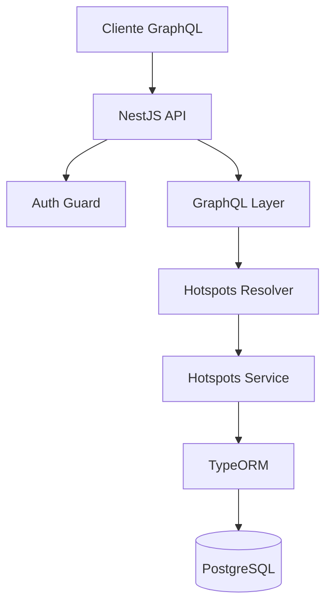

# API de Hotspots

## Introducción
API GraphQL desarrollada con NestJS para gestionar y consultar información sobre puntos de acceso WiFi (hotspots) en la Ciudad de México. La API permite realizar búsquedas por ubicación, colonia y proximidad geográfica.

## Dependencias y Versiones

### Principales
- Node.js >= 18
- NestJS
- TypeScript
- TypeORM
- PostgreSQL
- GraphQL

# Estructura del Proyecto

```
src/
├── database/
│   ├── migrations/
│   └── seeds/
├── hotspots/
│   ├── dto/
│   ├── entities/
│   ├── hotspots.resolver.ts
│   └── hotspots.service.ts
├── guards/
├── plugins/
└── utils/
```
## Instrucciones de Despliegue

### Variables de Entorno
Crear archivo `.env` con:

```bash
DATABASE_HOST=localhost
DATABASE_PORT=5432
DATABASE_USERNAME=postgres
DATABASE_PASSWORD=your_password
DATABASE_NAME=hotspots_db
API_KEY=your_api_key
PORT=3000
MAX_LIMIT=100
MIN_LIMIT=1
MIN_PAGE=1
```

### Instalación Local

```bash
Instalación de dependencias
npm install --legacy-peer-deps
- Desarrollo
npm run start:dev
- Producción
npm run start:prod
```

### Docker

## Diagrama de la Solución



## Desarrollo de la Solución

### Características Principales

1. **API GraphQL**
   - Consultas paginadas
   - Búsqueda por ID/UUID
   - Filtrado por vecindario
   - Búsqueda por proximidad geográfica

2. **Seguridad**
   - Autenticación por API Key
   - Protección con Helmet
   - Validación de parámetros
   - CORS configurado

3. **Base de Datos**
   - Migraciones automáticas
   - Seeding de datos desde CSV
   - Timestamps automáticos

### Endpoints GraphQL
#### *Algunos endpoints pueden recibir opcionalmente (page, limit) si no, se toma un valor por defecto

#### Lista paginada de hotspots
```graphql
query {
  hotspots {
    total
    data {
        uuid
        id
        program
        latitude
        longitude
        neighborhood
        borough
    }
  }
}
```

#### Buscar hotspot específico
```graphql
query {
  hotspot(id: "AICMT1-GW001") {
    id
    program
    latitude
    longitude
    neighborhood
    borough
  }
}
```


#### Filtrar por vecindario
```graphql
query {
  hotspotsByNeighborhood(
    neighborhood: "PEÑON DE LOS BAÑOS"
    limit: 100
  ) {
    total
    data {
        id
        program
        latitude
        longitude
        neighborhood
        borough
    }
  }
}
```

#### Buscar por proximidad
```graphql
query {
  hotspotsByProximity(
    latitude: 19.3236251
    longitude: -99.1469772
    limit: 1000
    distance: 1
  ) {
    total
    data {
        id
        program
        latitude
        longitude
        neighborhood
        borough
    }
  }
}
```
